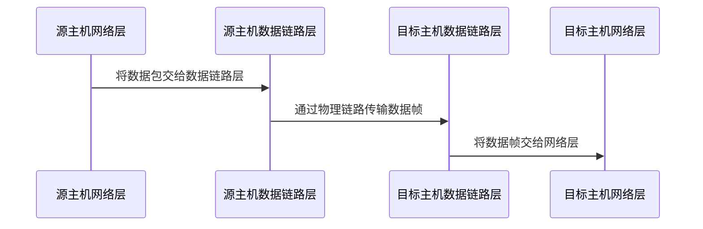

# 数据链路层

数据链路层位于计算机网络体系结构的第二层，需要完成以下任务：

- 向网络层提供一个定义良好的服务接口；
- 将字节组装成帧，成为自包含的数据段；
- 检测和纠正传输错误；
- 调节数据流，确保慢速的接收方不会被发送方淹没。

## 提供给网络层的服务

数据链路层的功能是为网络层**提供服务**，将数据从源主机的网络层传输到目标主机的网络层。

数据链路层可以设计成提供各种不同的服务，主要有以下三种：

- 无确认的无连接服务；
- 有确认的无连接服务；
- 有确认的面向连接服务。

无确认的无连接服务指源主机向目标主机发送独立的帧，目标主机不对这些帧进行确认。以太网就是一个提供此类服务的实例。

从可靠性的角度而言，下一步是有确认的无连接服务。此类服务仍然没有建立逻辑连接，但是发送方会对每一个帧进行单独的确认，以判断是否发送成功，若失败则会重新发送帧。WiFi 是一个典型的例子。

最复杂的面向连接的服务要求源主机和目标主机在传输数据前建立一个连接，在连接上发送的每一帧都被编号，以保证所有帧都按正确的顺序被接收到仅一次。

## 成帧

为了向网络层提供服务，数据链路层必须使用物理层提供的服务。然而，虽然物理层在信道存在噪声时存在一些降低误码率的操作，但数据链路层不能保证接收到的比特流没有错误。因此在数据链路层对比特流进行**检测错误**和**纠正错误**是必须的。

对于数据链路层来说，通常的做法是将比特流拆分成离散的帧，为每一帧计算一个**校验和**，并将校验和放在帧序列中一同传输。当接收到一帧时，需要重新计算校验和来检测或者纠正可能的错误。

成帧就是将比特流拆分的过程，需要良好的设计，主要有以下四种方法：

- 字节计数法；
- 字节填充的标志字节法；
- 比特填充的标志比特法；
- 物理层编码例外法。

### 字节计数法

**字节计数法**是最基础的一种方法，利用帧头中的一个字段标识该帧中的字符数。当目标方的数据链路层看到帧头的计数值，就能得知后面数据段的长度是多少**字节**。

这种方法的缺陷在于，如果某一个帧头出现了错误，那么后边的所有信息都讲无法被正确解析，且由于无法通过相对信息计算帧结束的位置，校验和也没法计算。

### 字节填充的标志方法

**字节填充的标志方法**考虑到了前面的问题，它让每一帧用一些特殊的字节作为开始和结束，被称为**标志字节**。因此只需要搜索两个连续的标志字节就可以完成同步。

这样的方法仍有问题，就是万一数据段中出现了标志字节的模式，则可能分割错误，因此考虑用一种**转义字节**来进行处理，类似转义字符，比较好理解。

### 比特填充的标志比特法

**比特填充的标志比特法**考虑到字节填充只能使用 8 比特字节的缺陷，将帧的划分在比特级完成，因此帧的大小可以是任意比特。

当采用这种方法成帧时，帧的开始和结束有一个特殊的比特模式标记即 `01111110` 或者 `0x7E`。为了避免数据段中存在这个模式，链路层在发送数据段时，每遇到连续的 5 个 1，就会在后边填充一个 0，这就同时保证了同步和正确性，同时大大提高了编码效率。

### 物理层编码例外法

**物理层编码例外法**利用物理层编码中的无效码字（例如 4B/5B 线路编码模式下，4个数据被映射成 5 个信号比特，这会产生 16 个无效码字），这些码字不会在数据段中出现，可以将他们作为帧头和帧尾来进行标志。

还有的协议会组合使用上述方法，如以太网的 IEEE 802.11 用一个定义良好的比特模式标识一帧的开始，称其为**前导码**，之后是帧头的长度字段，以指定帧的结尾。

## 错误控制和流量控制

若能够正确的接收到每一帧，链路层接下来的任务就是保证每一帧能够按顺序地被接收，同时控制好发送方的发送速度以匹配接收方的接收速度，总结起来主要有以下几个工作：

- 管理好计时器和序号；
- 基于反馈的流量控制；
- 基于速率的流量控制。

我们在这里主要关心前个。

