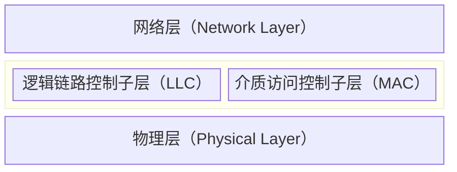

# 概述

在任何一个广播网络中，关键的问题是当多方竞争信道的使用权时如何确定谁可以使用信道。这样的广播信道被称为**多路访问信道**或**随机访问信道**。用来确定多路访问信道的下一个使用者的协议属于**数据链路层**的一个子层，该层被称为**介质访问控制子层**。

## 信道分配问题

信道把每个用户与所有其他用户连接在一起，任何正在使用信道的用户和其它也想使用信道的用户会相互干扰。因此需要面临所谓的信道分配问题，主要有两种分配方式即**静态分配**和**动态分配**。

## 静态信道分配

静态信道分配的思想就是把信道容量拆分给多个用户使用，使用某种**多路复用技术**，比如[频分多路复用](#)等。每个用户在预定的时间段或频率上独占信道。这种方法的优点是简单且易于实现，适用于负载较为恒定的环境。

然而，实际网络中流量往往具有**突发性**特征，因此静态分配往往会造成信道的浪费和阻塞。因此，在实际应用中，静态分配通常只适用于特定的场景，而在大多数情况下，更为灵活的动态分配方法更为常见。

## 动态信道分配的假设

为了讨论动态信道分配的问题，我们需要做出如下形式化的假设：

- **流量独立**：每个用户的流量是独立的，用户之间的流量不会相互影响。这意味着每个用户的发送行为是独立的，不会因为其他用户的行为而改变。
- **单信道**：所有用户共享一个单一的信道进行通信，没有多个信道可供选择。这意味着所有的通信都必须在同一个信道上进行，用户之间需要协调以避免冲突。
- **冲突可观察**：当两个或多个用户同时发送数据时，会发生冲突，并且这种冲突是可以被检测到的。用户能够检测到冲突的发生，并采取相应的措施来解决冲突。
- **时间连续或分槽**：时间可以是连续的，也可以被划分为离散的时间槽。在连续时间模型中，用户可以在任意时间点发送数据；在分槽时间模型中，用户只能在特定的时间槽内发送数据。
- **载波侦听或不听**：有了载波侦听的假设，一个站在试图使用信道之前就能知道该信道是否正在被使用。

具体的动态分配协议将在后文讨论。

## 局域网

局域网（LAN）是在一个小区域范围内对各种数据通信设备提供了互连的信息网。决定局域网特性的主要技术有**用以传输数据的传输介质**、**用以连接各种设备的拓扑结构**和**用以共享资源的介质访问控制方法**。



传统的 LAN 大多是共享介质的 LAN（即采用广播信道），不需要路由选择功能，因此只具备 OSI 的第 1、2 层功能。在数据链路层，重点要解决介质访问控制功能，所以，**数据链路层**又分为逻辑链路控制子层（LLC）和介质访问控制子层（MAC）。

其中 MAC 负责决定网络**信道的分配**问题，LLC 对不同的 MAC 协议进行**统一封装**，使得网络层能忽视 MAC 协议的多样性。

### 拓扑结构

=== "星型"

    ```mermaid
    graph TD;
        A[中心节点] --> B[节点1];
        A[中心节点] --> C[节点2];
        A[中心节点] --> D[节点3];
        A[中心节点] --> E[节点4];
    ```

    - **特点**: 所有节点通过一个中心节点连接，易于管理和故障排除，但中心节点故障会导致整个网络瘫痪。
    - **介质访问控制方法**: 通常使用集中控制方式，如令牌环或集中式调度。

=== "环型"

    ```mermaid
    graph LR;
        A[节点1] --> B[节点2];
        B[节点2] --> C[节点3];
        C[节点3] --> D[节点4];
        D[节点4] --> A[节点1];
    ```
    
    - **特点**: 每个节点连接到两个相邻节点，形成一个闭合环，数据沿一个方向传输，易于检测和隔离故障。
    - **介质访问控制方法**: 采用令牌环协议，节点只有在持有令牌时才能发送数据。

=== "星型环"

    ```mermaid
    graph LR;
        A[中心节点] --> B[节点1];
        A[中心节点] --> C[节点2];
        A[中心节点] --> D[节点3];
        A[中心节点] --> E[节点4];
        B[节点1] --> C[节点2];
        C[节点2] --> D[节点3];
        D[节点3] --> E[节点4];
        E[节点4] --> B[节点1];
    ```
    
    - **特点**: 结合星型和环型的优点，中心节点和环形连接提供冗余，增强网络可靠性。
    - **介质访问控制方法**: 结合集中控制和令牌环协议，确保高效的数据传输和故障恢复。

=== "总线型"

    ```mermaid
    graph TD;
        A[主干线] --- B[节点1];
        A[主干线] --- C[节点2];
        A[主干线] --- D[节点3];
        A[主干线] --- E[节点4];
    ```

    - **特点**: 所有节点共享一条主干线，结构简单，易于扩展，但主干线故障会影响整个网络。
    - **介质访问控制方法**: 使用载波侦听多路访问/冲突检测（CSMA/CD）协议，节点在发送数据前侦听信道状态。

=== "树型"

    ```mermaid
    graph TD;
        A[根节点] --> B[子节点1];
        A[根节点] --> C[子节点2];
        B[子节点1] --> D[子节点1.1];
        B[子节点1] --> E[子节点1.2];
        C[子节点2] --> F[子节点2.1];
        C[子节点2] --> G[子节点2.2];
    ```
    
    - **特点**: 以层次结构连接节点，易于管理和扩展，但某一分支故障可能影响该分支的所有节点。
    - **介质访问控制方法**: 采用集中控制或分布式控制方式，根据具体应用选择合适的协议。
