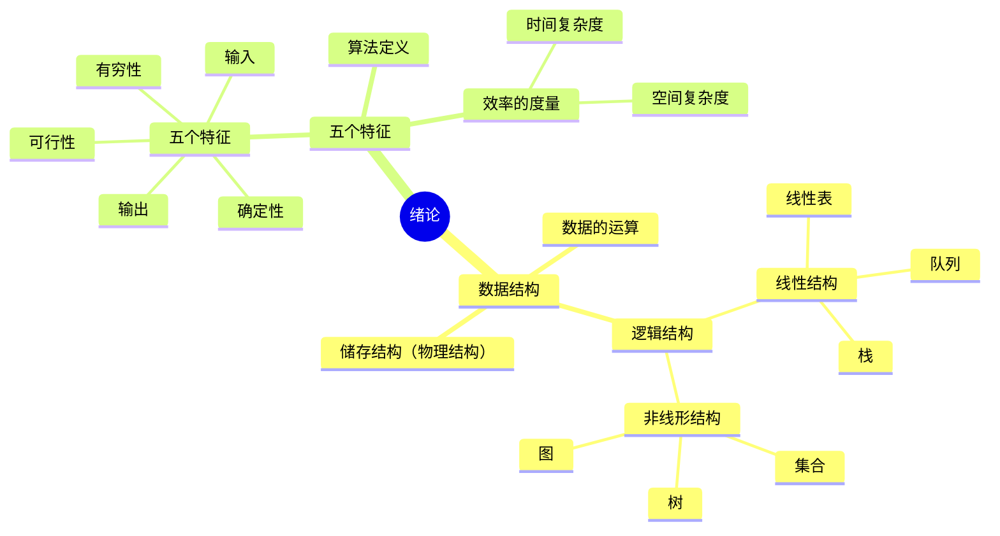

# 绪论

## 基本概念

### 术语

**数据**是信息的载体，是描述客观事物属性的数、字符以及所有能输入到计算机中并被计算机程序识别和处理的符号的集合。

**数据元素**是数据的基本单位，通常作为一个整体进行考虑和处理。一个数据元素可由若干个**数据项**组成，数据项是构成数据元素的不可分割的最小单位。

**数据对象**是具有相同性质的数据元素的集合，是数据的一个子集。例如，整数数据对象是集合 $N = \{0, \pm 1, \pm 2, \dots\}$。

**数据类型**是一个值的集合和定义在此集合上的一组操作的总称：

- 原子类型：其值不可再分的数据类型；
- 结构类型，其值可以再分解为若干成分的数据类型；
- 抽象数据类型，一个数学模型及定义在该模型上的一组操作。

**数据结构**是相互之间存在一种或多种特定关系的数据元素的集合。在任何问题中，数据元素都不是孤立存在的，他们之间存在某种关系，这种数据元素相互之间的关系称为**结构**。数据结构包括逻辑结构、存储结构和数据运算三方面的内容。

!!! tip "逻辑结构和存储结构"
    数据的逻辑结构和存储结构是密不可分的两个方面，一个算法的设计取决于所选定的逻辑结构，而算法的实现依赖于所采用的存储结构。

### 数据结构的三要素

**逻辑结构**是指数据元素之间的逻辑关系，即从逻辑关系上描述数据。它与数据的存储无关，是独立于计算机的。数据的逻辑关系结构分为**线性结构**和**非线形结构**，线性表是典型的线性结构；集合、树和图是典型的非线形结构。

**存储结构**是指数据结构在计算机中的表示（也称**映像**或**物理结构**）。它包括数据元素的表示和关系的表示。数据的存储结构是用计算机语言实现的逻辑结构，它**依赖于计算机语言**。数据的存储结构主要有顺序存储、链式存储、索引存储和散列存储。

**数据运算**是施加在数据上的运算包括运算的定义和实现。运算的定义是针对逻辑结构的，指出运算的功能；运算的实现是针对存储结构的，指出运算的具体步骤。

## 算法和算法的评价

见[算法导论](../IntroductionToAlgorithm/index.md)。
