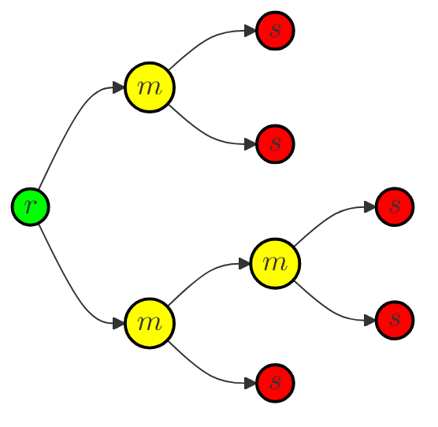
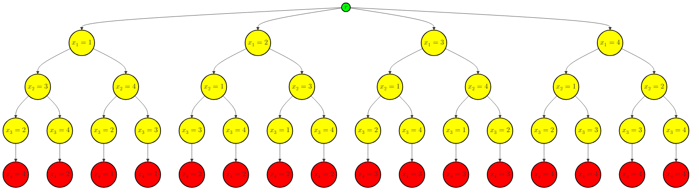
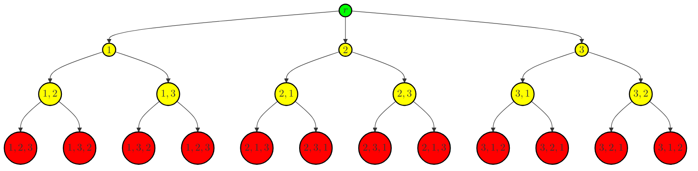

# 回溯法

??? abstract annotate "重点"
    - 方法的基本思想和基本步骤；
    - 回溯法是一种深度遍历的搜索；
    - 术语: 三种搜索空间, 活结点, 死结点, 扩展结点, 开始结点, 终端结点；
    - 两种解空间树和相应的算法框架 ；
    - 算法设计。(1)

1.  图和树的遍历、$n$ 皇后问题、0-1 背包、排列生成问题、TSP 问题。

## 基本思想

回溯法是一个既带有**系统性**，又带有**跳跃性**的搜索算法。前者体现在：算法在包含问题的所有解的解空间中，按照**深度优先**的侧路，从根节点出发搜索空间树；后者体现在：当算法搜索至空间树的任一节点时，判断子树是否包含问题的解，若不包含，则直接**跳过**子树，然后逐层向其祖先**回溯**，包含才进入子树进行搜索。

## 术语

### 解空间树

解空间树体现了搜索的具体过程，它包含三种节点即根节点、中间节点和叶节点。(1)
{ .annotate }

1.  - 根节点为搜索的**起点**；
    - 中间节点为根节点和终端节点以外的节点；
    - 叶节点即为终端节点，是问题的**解向量**。



搜索过程就是找一个或一些**特别的节点**。

### 节点的属性

节点分为活节点、扩展节点和死节点三种。当算法依据深度搜索**行至**某一个节点时，该节点被初始化为**活节点**；按照深度优先搜索，算法下一步将要访问当前节点的某一个子节点，这是对当前节点的一种**扩展**，因此当前节点为**扩展节点**；当算法无法在当前节点继续向纵深方向扩展时，当前节点被标记为**死节点**。

当算法标记一个死节点后，将**回溯**至最近的一个活节点并将其作为扩展节点继续搜索。

## 算法基本步骤

回溯算法的基本设计思路为

- 针对问题，定义问题的解空间；(1)
    { .annotate }

    1.  定义解空间就是对问题进行编码。

- 确定易于搜索的空间组织结构；(1)
    { .annotate }

    1.  即按照**树**或者**图**来组织。

- 以深度优先方式搜索子空间，搜索过程中裁剪掉死节点的子树提高效率；

下面针对具体问题进行分析。

## 算法实例

### $n$ 皇后问题

!!! question "问题描述"
    根据国际象棋的规则，皇后可以攻击与同处一行、一列或一条斜线上的棋子。给定 $n$ 个皇后和一个 $n \times n$ 大小的棋盘，寻找使得所有皇后之间无法相互攻击的摆放方案。

本文考虑 $n = 4$ 的情况。皇后数量和棋盘行（列）树都是 $4$，且约束**所有皇后不能处于同一行**，因此考虑**逐行放置**策略，即每一行仅放一个皇后，这个策略是显然的。

考虑对解进行编码，设一个解为一个四元组

$$
(x_1, x_2, x_3, x_4)
$$

其中 $x_i, i = 1, 2, 3, 4$ 表示皇后 $i$ 在第 $i$ 行的**列号**。则解空间可以表示为 

$$
\Omega = \{ (x_1, x_2, x_3, x_4 \mid x_i \in \{1, 2, 3, 4\}) \}
$$

可行解需满足以下约束

$$
\begin{aligned}
\begin{cases}
x_i \neq x_j & \forall i \neq j \\
\vert x_i - x_j \vert \neq \vert i - j \vert & \forall i \neq j
\end{cases}
\end{aligned}
$$

即保证每个皇后不在同一列，也不在对角线上。

由次构造出一个解空间



上图省略了很多解空间。在搜索时，算法根据深度优先搜索来检索可行解，依据约束条件进行剪枝，最后输出解：$(2,4,1,3)$ 和 $(3,1,4,2)$。

```python title="$n$ 皇后问题" linenums="1"
def solve_n_queens(n):
    # 检查在 (row, col) 放置皇后是否有效
    def is_valid(board, row, col):
        for i in range(row):
            # 检查同列是否有皇后
            if board[i] == col or \
               # 检查左上对角线是否有皇后
               board[i] - i == col - row or \
               # 检查右上对角线是否有皇后
               board[i] + i == col + row:
                return False
        return True

    # 递归地在棋盘上放置皇后
    def solve(board, row):
        if row == n:
            # 找到一个解，添加到结果中
            result.append(board[:])
            return
        for col in range(n):
            if is_valid(board, row, col):
                # 放置皇后
                board[row] = col
                # 继续放置下一行的皇后
                solve(board, row + 1)
                # 回溯，移除皇后
                board[row] = -1

    result = []
    board = [-1] * n  # 初始化棋盘
    solve(board, 0)  # 从第0行开始放置皇后
    return result  # 返回所有解
```

### 全排列问题

!!! question "全排列问题"
    给定正整数 $n$ 生成 $\{1, 2, \dots, n\}$ 的所有排列。

这个问题的解和解空间都很好定义，就是一个长度为 $n$ 的整数序列。考虑 $n = 3$ 的情况，问题的解空间为



上图已经做了剪枝，事实上如果单出暴力搜索，解空间会更大。

```python title="全排列问题" linenums="1"
def permute(nums):
    # 回溯法生成全排列
    def backtrack(start):
        if start == len(nums):
            # 找到一个排列，添加到结果中
            result.append(nums[:])
            return
        for i in range(start, len(nums)):
            # 交换元素
            nums[start], nums[i] = nums[i], nums[start]
            # 递归生成下一个位置的排列
            backtrack(start + 1)
            # 回溯，恢复原始顺序
            nums[start], nums[i] = nums[i], nums[start]

    result = []
    backtrack(0)  # 从第0个位置开始生成排列
    return result  # 返回所有排列
```
