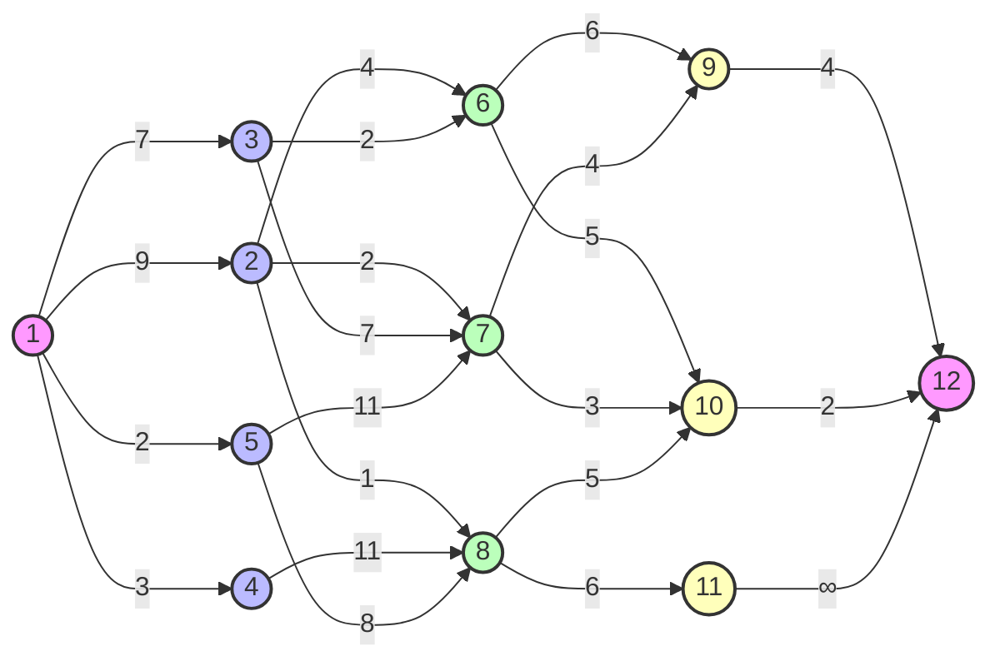

# 动态规划

??? abstract annotate "重点"

    - 方法的基本思想和基本步骤；
    - 动态规划和分治法求解问题的区别；
    - 最优性原理及其问题满足最优性原理的证明方法；
    - 算法设计。(1)

1.  多段图规划、矩阵链乘法、最大子段和以及最长公共子序列。

## 基本思想

动态规划（Dynamic Programming，简称DP）是一种将复杂问题分解成更小的子问题来解决的算法设计方法。但是同[分治法](./DivideAndconker.md)不同的是，动态规划求解的是**重叠**的子问题，而分治法要求分解的子问题不相交(1)。此时，动态规划对重叠的部分**只做一次运算并记录结果**，从而避免了重复计算来提高效率。
{ .annotate }

1.  同时，动态规划问题多采用自底向上的设计方法，而分治法采用自顶向下的方法。

## 基本步骤

我们通常按照如下 4 个步骤来设计一个动态规划算法：

1. 刻画一个最优解的结构特征；
2. 递归地定义最优解的结构特征；
3. 计算最优解的值，通常采用**自底向上**的方法；
4. 利用计算出的信息构造一个最优解。

前三个步骤是动态规划算法的基础，第四部用于得到解本身。

!!! note "最优子结构性质（最优性原理）"
    问题的最优解由相关子问题的最优解组合而成，而这些子问题可以独立求解。

!!! example annotate "最优性原理的证明"
    证明：设 $G$ 是一个有向加权图，则 $G$ 从顶点 $i$ 到顶点 $j$ 之间的最短路径问题满足最优性原理。(1)

    证. 设 $i \sim i_p \sim i_q \sim j$ 是一条最短路径，但其中的子路径 $i_p \sim i_q \sim j$ 不是最优的，不妨设其长度为 $\ell$。则存在一条子路径 $i_p \sim i_q' \sim j$，其长度 $\ell' < \ell$，从而路径 $i \sim i_p \sim i_q' \sim j$ 的长度小于 $i \sim i_p \sim i_q \sim j$，与题设矛盾。

1. 证明多考虑反正法。

## 算法设计实例

### 多段图规划

考虑多段图 $G = (V, E)$ 为一个**有向图**，且具有以下特征：

- 划分为 $k \geqslant 2$ 个不相交的集合 $V_i, 1 \leqslant i \leqslant k$；
- $V_1$ 和 $V_k$ 分别只有一个节点 $s$（源点）和 $t$（汇点）；
- 若 $\langle u, v \rangle \in E(G), u \in V_i$，则 $v \in V_{i + 1}$，边上成本记做 $c(u, v)$，若 $\langle u, v\rangle \notin E(G)$，则记 $c(u, v) = \infty$。

目标是求由 $s$ 到 $t$ 的最小成本路径。

我们来一步步地构造动态规划算啊，首先**验证问题满足最优性原理**：设 $s \sim v_{i_p} \sim v_{i_q} \sim t$ 是从 $s$ 到 $t$ 的最小成本，则 $v_{i_p} \sim v_{i_q} \sim t$ 一定是从 $v_{i_p}$ 到 $t$ 的最小成本路径。(1)
{ .annotate }

1.  反正法即可证明。

接下来尝试写出问题最优解的**递归式**，以反映最优解的结构特征。设 $cost(i, j)$ 表示 $V_i$ 中节点 $v_j$ 到汇点 $t$ 的最小成本路径，则有

$$
\begin{aligned}
cost(i, j) = 
\begin{cases}
    c(j, t) & i = k - 1 \\
    \min \{ c(j, l) + cost(i + 1, l) \} & 1 \leqslant i < k - 1
\end{cases}
\end{aligned}
$$

再然后考虑用自底向上的方法计算最优解的值，这里给出一个实例。



其中，同一种颜色的节点处于同一个集合 $V$ 中，从左到右依次是 $V_1 \sim V_5$。自底向上计算：

$$
\begin{aligned}
&cost(4, 9) = 4 \quad cost(4, 10) = 2 \quad cost(4, 11) = \infty \\
&cost(3, 6) = \min \{ 4 + 6, 5 + 2 \} = 7 \quad cost(3, 7) = \min \{ 4 + 4, 3 + 2 \} = 5 \\ 
&cost(3, 8) = \min \{ 5 + 2, 6 + \infty \} = 7 \\
&cost(2, 2) = \min \{ 4 + 7, 2 + 5, 1 + 7 \} = 7 \quad cost(2, 3) = \min \{ 2 + 7, 7 + 5 \} = 9 \\
&cost(2, 4) = \min \{ 11 + 7 \} = 18 \quad cost(2, 5) = \min \{ 11 + 5, 8 + 7 \} = 15 \\
&cost(1, 1) = \min \{ 9 + 7, 7 + 9, 3 + 18, 2 + 15 \} = 16
\end{aligned}
$$

从而得出最小成本为 16，最小成本路径有两条：$\{ 1, 2, 7, 10, 12 \}, \{ 1, 3, 6, 10, 12 \}$。

```python title="多段图" linenums="1"
def MultiStageGraph(G, k, n, p):
    """
    输入 n 个节点的 k 段图，假设顶点按顺序编号
    G: 图的邻接矩阵
    k: 段数
    n: 节点数
    p: 前驱节点数组
    """
    cost = [0] * n
    d = [0] * n
    for i in range(n - 2, -1, -1):
        cost[i] = float('inf')
        for j in range(i + 1, n):
            if G[i][j] != float('inf') and G[i][j] + cost[j] < cost[i]:
                cost[i] = G[i][j] + cost[j]
                d[i] = j
    path = [0] * (k + 1)
    path[0] = 0
    path[k] = n - 1
    for i in range(1, k):
        path[i] = d[path[i - 1]]
    return cost[0], path
```

算法时间复杂度为 $O(n + e)$。

### 矩阵链乘法

假设我们有一系列矩阵 $A_1, A_2, \ldots, A_n$，其中矩阵 $A_i$ 的维度为 $p_{i-1} \times p_i$。由于计算顺序不同（乘法结合律）会导致计算代价不同，矩阵链乘法问题的目标是找到一种最优的计算顺序，使得矩阵链相乘的计算代价最小。

我们定义 $m[i, j]$ 为计算矩阵 $A_i$ 到 $A_j$ 的最小计算代价。则有以下递归关系：

$$
m[i, j] = 
\begin{cases}
    0 & \text{if } i = j \\
    \min_{i \leq k < j} \{ m[i, k] + m[k+1, j] + p_{i-1} \cdot p_k \cdot p_j \} & \text{if } i < j
\end{cases}
$$

我们可以用动态规划的方法自底向上地计算最优解的值。

```python title="矩阵链乘法" linenums="1"
def MatrixChainOrder(p):
    """
    p: 矩阵链的维度数组
    返回最小计算代价和最优计算顺序
    """
    n = len(p) - 1
    m = [[0 for _ in range(n)] for _ in range(n)]
    s = [[0 for _ in range(n)] for _ in range(n)]

    for l in range(2, n + 1):
        for i in range(n - l + 1):
            j = i + l - 1
            m[i][j] = float('inf')
            for k in range(i, j):
                q = m[i][k] + m[k+1][j] + p[i] * p[k+1] * p[j+1]
                if q < m[i][j]:
                    m[i][j] = q
                    s[i][j] = k

    return m, s
```

在这个示例中，`p` 是矩阵链的维度数组，`m` 是最小计算代价矩阵，`s` 是最优计算顺序矩阵。算法时间复杂度为 $O(n^3)$。

### 最大子段和

假设我们有一个数组 $A = [a_1, a_2, \ldots, a_n]$，最大子段和问题的目标是找到一个连续子数组，使得其元素之和最大。

我们定义 $dp[i]$ 为以 $A[i]$ 结尾的最大子段和，则有以下递归关系：

$$
dp[i] = \max(A[i], dp[i-1] + A[i])
$$

初始条件为 $dp[0] = A[0]$。最终的最大子段和为 $dp$ 数组中的最大值。

```python title="最大子段和" linenums="1"
def MaxSubArray(A):
    """
    A: 输入数组
    返回最大子段和
    """
    n = len(A)
    dp = [0] * n
    dp[0] = A[0]
    max_sum = dp[0]

    for i in range(1, n):
        dp[i] = max(A[i], dp[i-1] + A[i])
        max_sum = max(max_sum, dp[i])

    return max_sum
```

在这个示例中，`A` 是输入数组，`dp` 是以每个元素结尾的最大子段和数组，`max_sum` 是最大子段和。算法时间复杂度为 $O(n)$。

### 最长公共子序列

假设我们有两个序列 $X = [x_1, x_2, \ldots, x_m]$ 和 $Y = [y_1, y_2, \ldots, y_n]$，最长公共子序列问题的目标是找到一个最长的子序列，使得它同时是 $X$ 和 $Y$ 的子序列。

我们定义 $dp[i][j]$ 为 $X[0:i]$ 和 $Y[0:j]$ 的最长公共子序列长度，则有以下递归关系：

$$
dp[i][j] = 
\begin{cases}
    0 & \text{if } i = 0 \text{ or } j = 0 \\
    dp[i-1][j-1] + 1 & \text{if } x_i = y_j \\
    \max(dp[i-1][j], dp[i][j-1]) & \text{if } x_i \neq y_j
\end{cases}
$$

初始条件为 $dp[0][j] = 0$ 和 $dp[i][0] = 0$。最终的最长公共子序列长度为 $dp[m][n]$。

```python title="最长公共子序列" linenums="1"
def LongestCommonSubsequence(X, Y):
    """
    X: 序列 X
    Y: 序列 Y
    返回最长公共子序列长度
    """
    m = len(X)
    n = len(Y)
    dp = [[0 for _ in range(n+1)] for _ in range(m+1)]

    for i in range(1, m+1):
        for j in range(1, n+1):
            if X[i-1] == Y[j-1]:
                dp[i][j] = dp[i-1][j-1] + 1
            else:
                dp[i][j] = max(dp[i-1][j], dp[i][j-1])

    return dp[m][n]
```

在这个示例中，`X` 和 `Y` 是输入序列，`dp` 是最长公共子序列长度矩阵。算法时间复杂度为 $O(m \cdot n)$。
