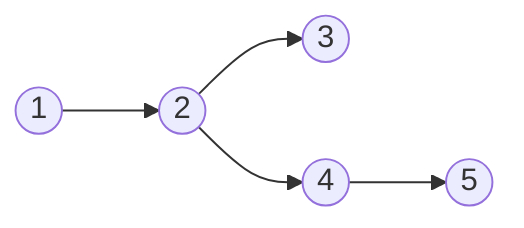

# 图算法

??? abstract "重点"
    1. BFS 和DFS 算法：
        - 白色、灰色和黑色结点概念和作用；
        - DFS 遍历过程中搜索边的种类和识别；
        - 计算过程及其时间复杂度。
    2. 最小生成树：
        - 安全边概念和一般算法（Generic algorithm）；
        - Kruskal 算法和 Prim 算法的计算过程和计算复杂性；
        - 两种贪心算法的贪心策略和贪心选择性质。
    3. 单源最短路径（略） ：
        - 单源最短路径 $\delta(s, v)$ 和短路径上界 `d[v]` 概念；
        - 边松弛技术及其一些性质；
        - 三种问题算法的计算过程及其时间复杂度：Bellman-Ford 算法、DAG 算法和 Dijkstra 算法。
    4. 所有点对最短路径（略） ：
        - 为什么能转换为矩阵乘法？
        - 基于矩阵乘法的较慢和快速算法的时间复杂度；
        - Floyd-Warshall Algorithm 的思路和时间复杂度；
        - Johnson Algorithm 适应的问题及其时间复杂度。

图是一种十分重要的数据结构，由结点和边组成。我们用 $G = (V, E)$ 表示一个图，其中 $V$ 和 $E$ 分别为图的结点集合和边集合。

## 图的逻辑表示

有两种方法来表示一个图结构，一种是**邻接链表**一种是**邻接矩阵**。前者适用于稀疏图，后者适用于稠密图。

=== "图"

    ```mermaid
    graph LR
        A((1)) --> B((2))
        B --> C((3))
        B --> D((4))
        C --> D
        D --> E((5))
        E --> A
        E --> B
    ```

=== "邻接链表"

    ```mermaid
    graph LR
        A((1)) --> F((2))
        B((2)) --> G((3)) --> H((4))
        C((3)) --> I((4))
        D((4)) --> J((5))
        E((5)) --> K((1)) --> L((2))
    ```

=== "邻接矩阵"

    $$
    \begin{aligned}
    \left(\begin{array}{ccccc}
    0 & 1 & 0 & 0 & 0 \\
    0 & 0 & 1 & 1 & 0 \\
    0 & 0 & 0 & 1 & 0 \\
    0 & 0 & 0 & 0 & 1 \\
    1 & 1 & 0 & 0 & 0
    \end{array}\right)
    \end{aligned}
    $$

邻接链表的空间需求为 $\Theta(V + E)$，邻接矩阵空间需求为 $\Theta(V^2)$。

## 广度优先搜索

广度优先搜索按照从源结点开始，系统性地探索当前结点的**所有邻居**，按照**广度优先**的原则遍历图。

搜索过程将结点分为白色、灰色和黑色三种，白色代表结点**尚未被发现**，灰色代表结点已经被发现但是**其邻居可能还没被发现**，最后黑色说明**该结点及其所有邻居**都已被发现。

```python title="广度优先搜索（BFS）" linenums="1"
def BFS(G, s):
    for u in G.V - [s]:
        u.color = 'white'
        u.d = float('inf')
        u.pi = None
    s.color = 'gray'
    s.d = 0
    s.pi = None
    Q = Queue()
    Q.put(s)
    while not Q.empty():
        u = Q.get()
        for v in G.E[u]:
            if v.color == 'white':
                v.color = 'gray'
                v.d = u.d + 1
                v.pi = u
                Q.put(v)
        u.color = 'black'
```

广度优先搜索的总运行时间为 $O(V + E)$，是图的邻接链表大小的线性函数。

### 广度优先搜索树

在广度优先遍历的过程中，原先的图会被遍历的路径组织成一颗**搜索树**，代码中用 `note.pi` 记录了结点的前驱，可以根据这一信息构造搜索树。



上图为对本文一开始的图从 1 号结点开始广度优先搜索生成的广度优先搜索树。


## 深度优先搜索

深度优先搜索按照从源结点开始，尽可能深地探索每一个分支，直到不能继续为止，然后回溯并继续探索下一个分支。

搜索过程同样将结点分为白色、灰色和黑色三种，白色代表结点**尚未被发现**，灰色代表结点已经被发现但是**其邻居可能还没被发现**，最后黑色说明**该结点及其所有邻居**都已被发现。

```python title="深度优先搜索（DFS）" linenums="1"
def DFS(G):
    for u in G.V:
        u.color = 'white'
        u.pi = None
    time = 0
    for u in G.V:
        if u.color == 'white':
            DFSVisit(G, u, time)

def DFSVisit(G, u, time):
    time += 1
    u.d = time
    u.color = 'gray'
    for v in G.E[u]:
        if v.color == 'white':
            v.pi = u
            DFSVisit(G, v, time)
    u.color = 'black'
    time += 1
    u.f = time
```

深度优先搜索的总运行时间为 $O(V + E)$，同样是图的邻接链表大小的线性函数。

### 深度优先搜索森林

在深度优先搜索的过程中，原始图会因被算法的搜索路径组织成一片深度优先搜索**森林**。

=== "图"

    ```mermaid
    graph LR
        A((1)) --> B((2))
        A((1)) --> D((4))
        B --> E((5))
        C((3)) --> F((6))
        C --> E
        D --> B
        E --> D
        F --> F
    ```

=== "搜索森林"

    ```mermaid
    graph LR
        A((1)) --> B((2))
        B --> E((5))
        E --> D((4))
        C((3)) --> F((6))
    ```

### 边的分类

深度优先搜索的另一个性质是，可以利搜索来对边进行分类。对于在图 $G$ 上运行深度优先搜索生成的深度优先森林 $G_{\pi}$，我们可以定义 4 种边的类型：

| 名称 | 定义 |
|: --- |: --- |
| 树边 | 为深度优先森林 $G_{\pi}$ 中的边。如果结点 $v$ 是因为算法对边 $(u, v)$ 的探索而**首先**被发现，则 $(u, v)$ 是一条树边。 |
| 后向边 | 后向边 $(u, v)$ 是将结点 $u$ 连接到其在深度优先树中一个**祖先结点** $v$ 的边。由于有向图中可以有自循环，自循环也被认为是后向边。 |
| 前向边 | 是将结点 $u$ 连接到其在深度优先树中一个**后代结点** $v$ 的边。|
| 横向边 | 指其他所有的边，这些边可以连接同一颗深度优先树中的两个结点，**只要其中一个结点不是另一个结点的祖先**，也可以连接不同深度优先树中的两个结点。 |

可以通过观察原图结构和深度优先搜索树结构来确定边的类型，也可以通过节点的颜色属性在 DFS 时对边进行分类：当第一次探索边 $(u, v)$ 时，节点 $v$ 的颜色能够告诉我们关于该边的一些信息。(1)
{ .annotate }

1.  - 节点 $v$ 为白色表明边 $(u, v)$ 是一条树边；
    - 节点 $v$ 为灰色表明边 $(u, v)$ 是一条后向边；
    - 节点 $v$ 为黑色表明边 $(u, v)$ 是一条前向边或横向边。

## 拓扑排序

拓扑排序是一种对有向无环图（DAG）进行排序的方法，使得对于图中的每一条有向边 $(u, v)$，顶点 $u$ 在排序中出现在顶点 $v$ 之前。换句话说，拓扑排序是图的顶点的线性序列，它满足每个顶点的所有前驱顶点都排在它之前。

```python title="利用深度优先搜索实现拓扑排序" linenums="1"
def TopologicalSort(G):
    DFS(G)
    return sorted(G.V, key=lambda x: x.f, reverse=True)
```

拓扑排序在许多应用中非常有用，例如任务调度、编译器中的符号解析、数据序列化等。

## 最小生成树

最小生成树（Minimum Spanning Tree, MST）是一个连通无向图的子图，它包含图中的所有顶点，并且边的总权重最小。换句话说，最小生成树是一个覆盖所有顶点且边权重和最小的无环子图。

### 朴素算法

找出最小生成树通常使用**贪心策略**：在每个时刻生长最小生成树的一条边，并在策略的实施过程中，管理一个遵守下述循环不变式的集合 $A$。

!!! quote "在每遍循环之前，$A$ 是某刻最小生成树的一个子集。"

在每一步，我们要做的事情是选择一条边 $(u, v)$，将其加入到集合 $A$ 中，使得 $A$ 不违反循环不变式。由于我们安全地将这种边加入到集合 $A$ 中，称这样的边为集合 $A$ 的**安全边**。

<div class="pseudocode">
    \begin{algorithm}
    \caption{最小生成树的朴素算法}
    \begin{algorithmic}
    \STATE $A = \emptyset$;
    \WHILE{$A$ does not form a spanning tree}
        \STATE Find an edge $(u, v)$ that is safe for $A$;
        \STATE $A= A \cup \{(u, v)\}$;
    \ENDWHILE
    \RETURN{$A$}
    \end{algorithmic}
    \end{algorithm}
</div>

算法的关键在第三行即找到一条安全边，我们可以通过对图进行一些额外的定义来发掘一个辨认安全边的规则。

!!! note "图和切割"
    无向图 $G = (V, E)$ 的一个**切割** $(S, V - S)$ 是集合 $V$ 的一个划分。如果一条边 $(u, v) \in E$ 的两个端点分别位于集合 $S$ 和 $V - S$，则称这条边为**横跨**切割 $(S, V - S)$。如果集合 $A$ 中不存在横跨切割的边，则称该切割**尊重**集合 $A$。在横跨一个切割的所有边中，权重最小的边称为**轻量级边**。

!!! note "安全边辨认规则"
    设 $G = (V, E)$ 是一个在边 $E$ 上定义了实数值权重函数 $w$ 的连通无向图。设集合 $A$ 为 $E$ 的一个子集，且 $A$ 包括在图 $G$ 的某棵最小生成树中，设 $(S, V - S)$ 是图 $G$ 中尊重集合 $A$ 的任意一个切割，又设 $(u, v)$ 是横跨切割 $(S, V - S)$ 的一条轻量级边。那么边 $(u, v)$ 对于集合 $A$ 是安全的。

!!! note annotate "推论"
    设 $G = (V, E)$ 是一个在边 $E$ 上定义了实数值权重函数 $w$ 的连通无向图。设集合 $A$ 为 $E$ 的一个子集，且 $A$ 包括在图 $G$ 的某棵最小生成树中，并设 $C = (V_C, E_C)$ 为森林 $G(V, A)$ 中的一个连通分量（树）。如果边 $(u, v)$ 是连接 $C$ 和 $G_A$ 中某个其他连通分量的一条轻量级边(1)，则边 $(u, v)$ 对于集合 $A$ 是安全的。

1.  这里的轻量级边是指连接 $G_A$ 的各个连通分量的边中权重最小的边。

后面要介绍的 Kruskal 算法和 Prim 算法就利用了上面的推论。

### Kruskal 算法

Kruskal 算法找到安全边的方法是：构造森林 $G_A$，然后在所有连接森林中两棵不同树的边里面，找到权重最小的边 $(u, v)$。

```python title="Krusal 算法" linenums="1"
def KruskalMST(G, w):
    A = set()
    for v in G.V:
        MakeSet(v)      # 不相交的集合
    edges = sorted(G.E, key=lambda x: x.w)
    for u, v in edges:
        if FindSet(u) != FindSet(v):
            A.add((u, v))
            Union(u, v)
    return A
```

算法的运行时间依赖于不相交集合数据结构的实现方式。如果采用**不相交集合森林**表示并增加按秩合并和路径压缩的功能，算法的运行时间为 $O(E\lg V)$。

### Prim 算法

Prim 算法和 Kruskal 算法的区别在于，前者保证了集合 $A$ 中的边总是构成一棵树，再利用安全边辨认规则的推论，每次选择和 $A$ 相连的权重最小的边加入集合。

```python title="Prim 算法" linenums="1"
def PrimMST(G, w, r):
    for u in G.V:
        u.key = float("inf")
        u.pi = None
    r.key = 0
    Q = G.V
    while Q:
        u = ExtractMin(Q)
        for v in G.E(u):
            if v in Q and w(u, v) < v.key:
                v.pi = u
                v.key = w(u, v)
```

算法的运行时间依赖于优先队列的实现，如果采用**斐波那契堆**来实现，则 Prim 算法的运行时间为 $O(E + V\lg V)$，如果采用二叉最小堆实现，则运行时间为 $O(E\lg V)$。

## 单源最短路径


