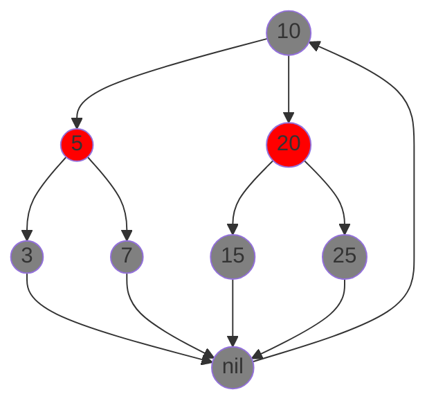

# 红黑树

红黑树是一种**平衡的**二叉搜索树，在一定程度上缓解了数据分布对二叉搜索树性能的影响。

??? note "二叉搜索树"
    二叉搜索树是一种节点**左子树的所有值小于节点值**，**右子树的所有值大于节点值**的树结构。

??? abstract "重点"

    - 红黑树的定义和节点结构与松弛思想；
    - 黑高概念；
    - 一棵 $n$ 个内点的红黑树的高度至多是 $2\lg(n+1)$；
    - 左旋算法；
    - 插入算法的时间、至多使用 2 次旋转；
    - 删除算法的时间、至多使用 3 次旋转。

## 红黑树的性质

红黑树中每个节点有五个属性：颜色、关键字、左孩子、右孩子和父节点，如果一个节点没有子节点或父节点，则该节点相应的指针属性为 `NIL`。我们可以把这些 `NIL` 节点视为指向二叉搜索树的**叶节点**的指针，而把带关键字的节点视为树的内部节点。

红黑树需要满足以下**红黑性质**

1. 每个节点是红色或者黑色；
2. 根节点是黑色的；
3. 每个叶节点是黑色的；
4. 如果一个节点是红色的，它的两个子节点都是黑色；
5. 对每个节点，从该节点到其所有后代叶节点的简单路径上，均包含相同数目的黑色节点。

以下是一个红黑树的例子：



我们用了一个**哨兵节点**表示所有的 `NIL` 以节省空间。

!!! note "黑高"
    定义从某个节点 $x$ 出发（不含该节点），到达一个叶节点的任意一条简单路径上的黑色节点个数为该节点的**黑高**。由于性质 5，可以定义一颗红黑树的黑高为根节点的黑高。

!!! note "松弛思想"
    红黑树的松弛思想是指在插入和删除操作时，**允许暂时违反红黑树的性质**，通过后续的调整（旋转和重新着色）来恢复红黑树的性质。

根据上面的思想可以说明为什么红黑树是一颗好的搜索树。

!!! note "红黑树的树高上界"
    一颗有 $n$ 个内部节点的红黑树的高度至多是 $2\lg(n+1)$。

## 旋转

在向红黑树中插入或删除节点时，可能会违反红黑树的性质，因此需要一些操作改变节点结构来维护这些性质，**旋转**就是这样的操作。

=== "右旋前（左旋后）"

    ```mermaid
    graph TD;
        A(("$$y$$")) --> B(("$$x$$"))
        B --> C(("$$\alpha$$"))
        B --> D(("$$\beta$$"))
        A --> E(("$$\gamma$$"))
    ```

=== "右旋后（左旋前）"

    ```mermaid
    graph TD;
        B(("$$x$$")) --> C(("$$\alpha$$"))
        B --> A(("$$y$$"))
        A --> D(("$$\beta$$"))
        A --> E(("$$\gamma$$"))
    ```

上面的示意图展示了对节点 $y$ 做右旋或者对 $x$ 做左旋操作时，树的结构的变化，具体的代码算法如下：

```python title="左旋" linenums="1"
def LeftRotate(T, x):
    y = x.right  # 将 y 设为 x 的右孩子
    x.right = y.left  # 将 y 的左孩子移作 x 的右孩子
    if y.left != T.nil:
        y.left.p = x
    y.p = x.p  # 将 x 的父亲设为 y 的父亲
    if x.p == T.nil:
        T.root = y
    elif x == x.p.left:
        x.p.left = y
    else:
        x.p.right = y
    y.left = x  # 将 x 设为 y 的左孩子
    x.p = y
```

旋转操作的运行时间是 $O(1)$，且在旋转操作中，**只有指针改变，其他所有属性保持不变**。

## 插入

向红黑树中插入一个节点的操作和二叉排序树的插入操作十分类似：

```python title="插入" linenums="1"
def RBInsert(T, z):
    y = T.nil
    x = T.root
    while x != T.nil:       # 遍历找到合适的位置（不能是叶节点 NIL）
        y = x
        if z.key < x.key:
            x = x.left
        else:
            x = x.right
    z.p = y                 # 准备插入
    if y == T.nil:
        T.root = z
    elif z.key < y.key:
        y.left = z
    else:
        y.right = z
    z.left = T.nil
    z.right = T.nil
    z.color = 'red'
    RBInsertFixup(T, z)
```

都是根据待插入节点的关键字大小，在树中遍历找到合适的位置然后插入。只是会将新节点的左右孩子（都是叶节点）设置为 `NIL`，并且将其**初始化为红色**，最后还多了一步对红黑性质的维护。

### 维护红黑性质

由于新节点被初始化为红色，因此它可能会违反红黑树的性质，需要多余的步骤来维护红黑性质。

```python title="维护性质" linenums="1"
def RBInsertFixup(T, z):
    while z.p.color == 'red':
        if z.p == z.p.p.left:
            y = z.p.p.right
            if y.color == 'red':        # 情况 1
                z.p.color = 'black'
                y.color = 'black'
                z.p.p.color = 'red'
                z = z.p.p
            else:
                if z == z.p.right:      # 情况 2
                    z = z.p
                    LeftRotate(T, z)
                z.p.color = 'black'     # 情况 3
                z.p.p.color = 'red'
                RightRotate(T, z.p.p)
        else:
            y = z.p.p.left
            if y.color == 'red':
                z.p.color = 'black'
                y.color = 'black'
                z.p.p.color = 'red'
                z = z.p.p
            else:
                if z == z.p.left:
                    z = z.p
                    RightRotate(T, z)
                z.p.color = 'black'
                z.p.p.color = 'red'
                LeftRotate(T, z.p.p)
    T.root.color = 'black'
```

对树的红黑性质的维护主要取决于新插入的节点对性质的改变。通过简单的分析可知，插入新节点之可能破坏性质 2 或性质 4，前者在新节点为根节点时发生，后者则发生在新节点的父节点为红色时。这之后就是分别根据可能的情况分析处理即可。

!!! note annotate "插入节点时可能的情况"

    - **情况 1**：新节点的叔叔节点是红色；(1)
    - **情况 2**：新节点的叔叔节点是黑色，且新节点是其父节点的右孩子；(2)
    - **情况 3**：新节点的叔叔节点是黑色，且新节点是其父节点的左孩子。(3)

1.  将新节点的父节点和叔叔节点都重新着色为黑色，并将新节点的祖父节点重新着色为红色，然后将当前节点指向其祖父节点，继续循环。
2.  将当前节点指向其父节点，并对当前节点进行左旋。
3.  将新节点的父节点重新着色为黑色，并将新节点的祖父节点重新着色为红色，然后对新节点的祖父节点进行右旋。

通过上述步骤，可以确保红黑树的性质在插入新节点后依然得到维护。

## 删除

删除红黑树中的一个节点的操作和二叉排序树的删除操作类似，但需要额外的步骤来维护红黑性质。

```python title="删除" linenums="1"
def RBDelete(T, z):
    y = z
    y_original_color = y.color
    if z.left == T.nil:
        x = z.right
        RBTransplant(T, z, z.right)
    elif z.right == T.nil:
        x = z.left
        RBTransplant(T, z, z.left)
    else:
        y = TreeMinimum(z.right)
        y_original_color = y.color
        x = y.right
        if y.p == z:
            x.p = y
        else:
            RBTransplant(T, y, y.right)
            y.right = z.right
            y.right.p = y
        RBTransplant(T, z, y)
        y.left = z.left
        y.left.p = y
        y.color = z.color
    if y_original_color == 'black':
        RBDeleteFixup(T, x)
```

删除操作的关键在于如何处理被删除节点的颜色和其对红黑性质的影响。

### 维护红黑性质

删除节点后，可能会破坏红黑树的性质，需要额外的步骤来维护红黑性质。

```python title="维护性质" linenums="1"
def RBDeleteFixup(T, x):
    while x != T.root and x.color == 'black':
        if x == x.p.left:
            w = x.p.right
            if w.color == 'red':        # 情况 1
                w.color = 'black'
                x.p.color = 'red'
                LeftRotate(T, x.p)
                w = x.p.right
            if w.left.color == 'black' and w.right.color == 'black':  # 情况 2
                w.color = 'red'
                x = x.p
            else:
                if w.right.color == 'black':  # 情况 3
                    w.left.color = 'black'
                    w.color = 'red'
                    RightRotate(T, w)
                    w = x.p.right
                w.color = x.p.color  # 情况 4
                x.p.color = 'black'
                w.right.color = 'black'
                LeftRotate(T, x.p)
                x = T.root
        else:
            w = x.p.left
            if w.color == 'red':
                w.color = 'black'
                x.p.color = 'red'
                RightRotate(T, x.p)
                w = x.p.left
            if w.right.color == 'black' and w.left.color == 'black':
                w.color = 'red'
                x = x.p
            else:
                if w.left.color == 'black':
                    w.right.color = 'black'
                    w.color = 'red'
                    LeftRotate(T, w)
                    w = x.p.left
                w.color = x.p.color
                x.p.color = 'black'
                w.left.color = 'black'
                RightRotate(T, x.p)
                x = T.root
    x.color = 'black'
```

删除节点后，可能会破坏红黑树的性质，通过上述步骤可以确保红黑树的性质在删除节点后依然得到维护。

!!! note annotate "删除节点时可能的情况"

    - **情况 1**：兄弟节点是红色；(1)
    - **情况 2**：兄弟节点是黑色，且兄弟节点的两个孩子都是黑色；(2)
    - **情况 3**：兄弟节点是黑色，且兄弟节点的左孩子是红色，右孩子是黑色；(3)
    - **情况 4**：兄弟节点是黑色，且兄弟节点的右孩子是红色。(4)

1.  将兄弟节点重新着色为黑色，并将父节点重新着色为红色，然后对父节点进行左旋。
2.  将兄弟节点重新着色为红色，并将当前节点指向其父节点，继续循环。
3.  将兄弟节点的左孩子重新着色为黑色，并将兄弟节点重新着色为红色，然后对兄弟节点进行右旋。
4.  将兄弟节点重新着色为父节点的颜色，并将父节点重新着色为黑色，将兄弟节点的右孩子重新着色为黑色，然后对父节点进行左旋。

通过上述步骤，可以确保红黑树的性质在删除节点后依然得到维护。
